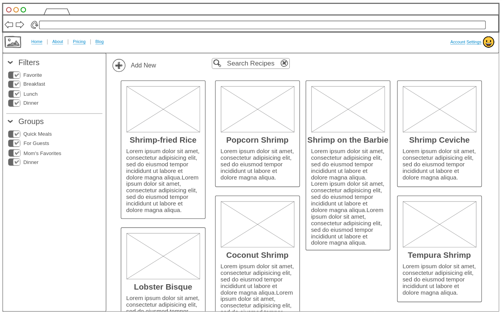
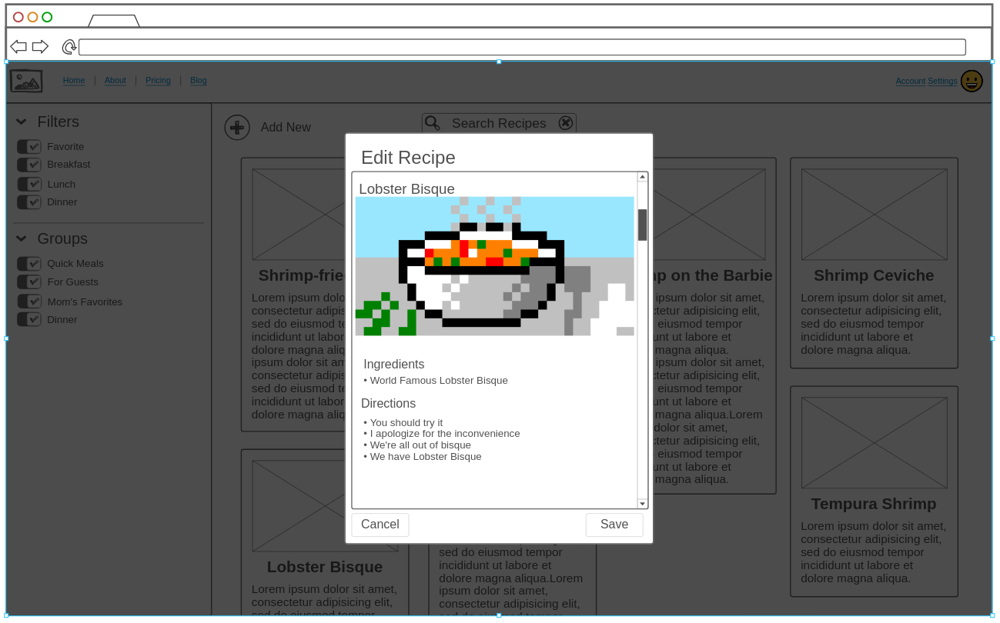
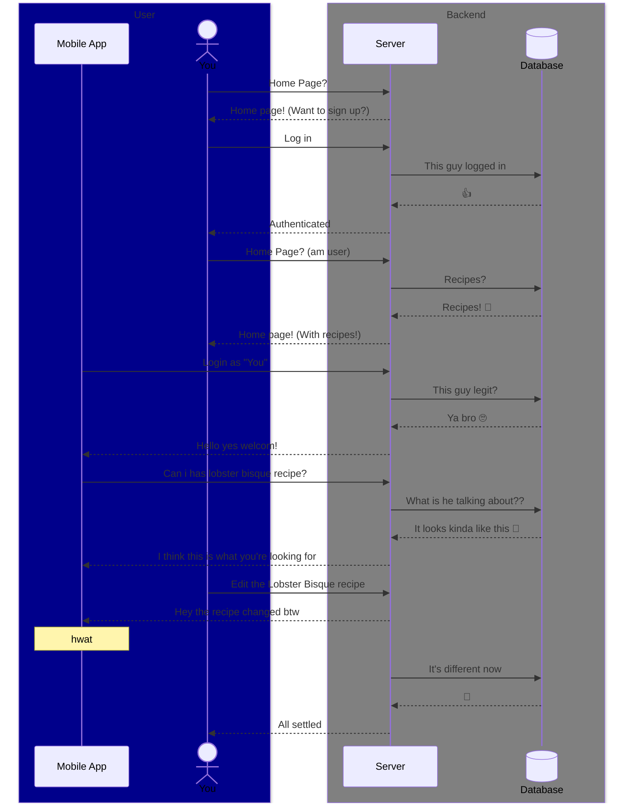

# Cooked Book

[My Notes](notes.md)

Cooked Book will be an application where you can safely store and rank your favorite recipes for quick access and searching.

## 🚀 Specification Deliverable

For this deliverable I did the following. I checked the box `[x]` and added a description for things I completed.

- [x] Proper use of Markdown
- [x] A concise and compelling elevator pitch
- [x] Description of key features
- [x] Description of how you will use each technology
- [x] One or more rough sketches of your application. Images must be embedded in this file using Markdown image references.

### Elevator pitch

With this app, you can easily create new recipes and save them online, view your recipes in a clear and concise interface, and track which ingredients you've already found or used to avoid forgetting the salt or putting in too much flour! Share recipes with your family, and search through them quickly for easy meal planning! Record family recipes for your posterity!

### Design

The front page for a signed-in user, giving quick access to their saved recipes with the option to filter and search.

The edit menu, where a user can create and edit their recipes. It will be more guided than shown here

I honestly didn't know exactly what I was supposed to do with this. It isn't some social application like the example we were given. But this is how I imagine interactions (kinda) will look like between a user's browser and the server

### Key features

- Login, logout, sign up
- Create, read, update, and delete recipes
  - title
  - (optional) picture
  - ingredients
  - instructions
  - categories
- View all recipes and filter based on information like prep time, number of ingredients, categories, etc.
- Conveniently view recipes with (optional) helpers for cooking, like an ingredient tracker and built-in cook timer

### Technologies

I am going to use the required technologies in the following ways.

- **HTML** - Correct html for page structure, 4 pages minimum (login / signup, home, about, view-recipe)
- **CSS** - Proper styling to aid navigation and use, with soft colors, defined sections, and intuitive page layout
- **React** - Responsive recipe edit menu with draft saving, routing, and components
- **Service** - Backend service with endpoints for managing recipes, filtered searches, and authentication
- **External Service** - Use random pictures of meat as placeholder images using https://baconmockup.com/
- **DB/Login** - Register and log in users, store their recipes
- **WebSocket** - Synchronize changes between a user's instances
