# Cooked Book

[My Notes](notes.md)

Cooked Book will be an application where you can safely store and rank your favorite recipes for quick access and searching.

## 🚀 Specification Deliverable

For this deliverable I did the following. I checked the box `[x]` and added a description for things I completed.

- [x] Proper use of Markdown
- [x] A concise and compelling elevator pitch
- [x] Description of key features
- [x] Description of how you will use each technology
- [x] One or more rough sketches of your application. Images must be embedded in this file using Markdown image references.

### Elevator pitch

With this app, you can easily create new recipes and save them online, view your recipes in a clear and concise interface, and track which ingredients you've already found or used to avoid forgetting the salt or putting in too much flour! Share recipes with your family, and search through them quickly for easy meal planning! Record family recipes for your posterity!

### Design

The front page for a signed-in user, giving quick access to their saved recipes with the option to filter and search.

The edit menu, where a user can create and edit their recipes. It will be more guided than shown here

```mermaid
sequenceDiagram
    box darkblue User
    participant M as Mobile App
    actor Y as You
    end
    box Gray Backend
    participant S as Server
    participant Database@{"type":"database"}
    end
    Y ->> S: Home Page?
    S -->> Y: Home page! (Want to sign up?)
    Y ->> S: Sign up
    S ->> Database: Insert new user
    Database -->> S: 👍
    S -->> Y: Authenticated
    Y ->> S: Home Page? (am user)
    S ->> Database: Recipes?
    Database -->> S: Recipes! 🤩
    S -->> Y: Home page! (With recipes!)
    M ->> S: Login as "You"
    S ->> Database: This guy legit?
    Database -->> S: Ya bro 🙄
    S -->> M: Hello yes welcom!
    M ->> S: Can i has lobster bisque recipe?
    S ->> Database: What is he talking about??
    Database -->> S: It looks kinda like this 🍲
    S -->> M: I think this is what you're looking for
    Y ->> S: Edit the Lobster Bisque recipe
    S -->> M: Hey the recipe changed btw
    Note over M: hwat
    S ->> Database: It's different now
    Database -->>S: 🤷
    S -->> Y: All settled
```

I honestly didn't know exactly what I was supposed to do with this. It isn't some social application like the example we were given. But this is how I imagine interactions (kinda) will look like between a user and the server

### Key features

- Login, logout, sign up
- Create, read, update, and delete recipes
  - title
  - (optional) picture
  - ingredients
  - instructions
  - categories
- View all recipes and filter based on information like prep time, number of ingredients, categories, etc.
- Conveniently view recipes with (optional) helpers for cooking, like an ingredient tracker and built-in cook timer

### Technologies

I am going to use the required technologies in the following ways.

- **HTML** - Correct html for page structure, 4 pages minimum (login / signup, home, about, view-recipe)
- **CSS** - Proper styling to aid navigation and use, with soft colors, defined sections, and intuitive page layout
- **React** - Responsive recipe edit menu with draft saving, routing, and components
- **Service** - Backend service with endpoints for managing recipes, filtered search, and login
- **DB/Login** - Register and log in users, store their recipes
- **WebSocket** - Synchronize changes between a user's instances

## 🚀 AWS deliverable

For this deliverable I did the following. I checked the box `[x]` and added a description for things I completed.

- [ ] **Server deployed and accessible with custom domain name** - [My server link](https://yourdomainnamehere.click).

## 🚀 HTML deliverable

For this deliverable I did the following. I checked the box `[x]` and added a description for things I completed.

- [ ] **HTML pages** - I did not complete this part of the deliverable.
- [ ] **Proper HTML element usage** - I did not complete this part of the deliverable.
- [ ] **Links** - I did not complete this part of the deliverable.
- [ ] **Text** - I did not complete this part of the deliverable.
- [ ] **3rd party API placeholder** - I did not complete this part of the deliverable.
- [ ] **Images** - I did not complete this part of the deliverable.
- [ ] **Login placeholder** - I did not complete this part of the deliverable.
- [ ] **DB data placeholder** - I did not complete this part of the deliverable.
- [ ] **WebSocket placeholder** - I did not complete this part of the deliverable.

## 🚀 CSS deliverable

For this deliverable I did the following. I checked the box `[x]` and added a description for things I completed.

- [ ] **Header, footer, and main content body** - I did not complete this part of the deliverable.
- [ ] **Navigation elements** - I did not complete this part of the deliverable.
- [ ] **Responsive to window resizing** - I did not complete this part of the deliverable.
- [ ] **Application elements** - I did not complete this part of the deliverable.
- [ ] **Application text content** - I did not complete this part of the deliverable.
- [ ] **Application images** - I did not complete this part of the deliverable.

## 🚀 React part 1: Routing deliverable

For this deliverable I did the following. I checked the box `[x]` and added a description for things I completed.

- [ ] **Bundled using Vite** - I did not complete this part of the deliverable.
- [ ] **Components** - I did not complete this part of the deliverable.
- [ ] **Router** - I did not complete this part of the deliverable.

## 🚀 React part 2: Reactivity deliverable

For this deliverable I did the following. I checked the box `[x]` and added a description for things I completed.

- [ ] **All functionality implemented or mocked out** - I did not complete this part of the deliverable.
- [ ] **Hooks** - I did not complete this part of the deliverable.

## 🚀 Service deliverable

For this deliverable I did the following. I checked the box `[x]` and added a description for things I completed.

- [ ] **Node.js/Express HTTP service** - I did not complete this part of the deliverable.
- [ ] **Static middleware for frontend** - I did not complete this part of the deliverable.
- [ ] **Calls to third party endpoints** - I did not complete this part of the deliverable.
- [ ] **Backend service endpoints** - I did not complete this part of the deliverable.
- [ ] **Frontend calls service endpoints** - I did not complete this part of the deliverable.
- [ ] **Supports registration, login, logout, and restricted endpoint** - I did not complete this part of the deliverable.

## 🚀 DB deliverable

For this deliverable I did the following. I checked the box `[x]` and added a description for things I completed.

- [ ] **Stores data in MongoDB** - I did not complete this part of the deliverable.
- [ ] **Stores credentials in MongoDB** - I did not complete this part of the deliverable.

## 🚀 WebSocket deliverable

For this deliverable I did the following. I checked the box `[x]` and added a description for things I completed.

- [ ] **Backend listens for WebSocket connection** - I did not complete this part of the deliverable.
- [ ] **Frontend makes WebSocket connection** - I did not complete this part of the deliverable.
- [ ] **Data sent over WebSocket connection** - I did not complete this part of the deliverable.
- [ ] **WebSocket data displayed** - I did not complete this part of the deliverable.
- [ ] **Application is fully functional** - I did not complete this part of the deliverable.
